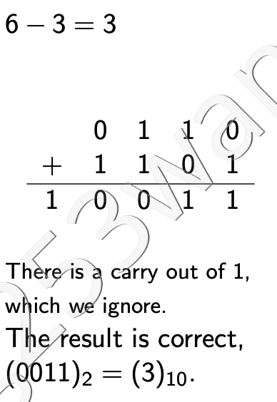
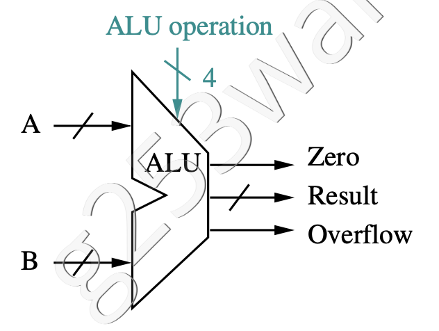
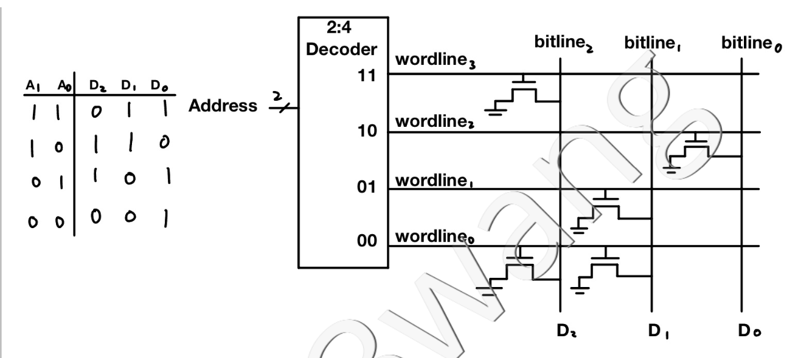

251:
- ARM64
- instruction: 32 bits, instruction size has no direct relationship with 32/64 bits system
- PC increment: 4 bytes
- word: 4 bytes ...... 64 bit machine should have word of 8 bytes, but 251 think otherwise...
- register size: 64 bits
- memory address: 64 bits, each memory address refer to a byte block, hence byte addressing
- memory capacity: 2^64 bytes
- every data in RAM is double-word, 8 bytes, 64 bits

# Lecture 1
Assembly language is a low-level programming language for a computer or other programmable device that is closest to the machine language. It is often specific to a particular computer architecture so there are multiple types of assembly languages. ARM is an increasingly popular assembly language.


ARM can be all of the below
- hardware archetecture
- assembly language
- program
- instruction set


In memory, from high memory address to low memory address, it goes
- stack (high mem addr)
- ...
- heap
- data (double words, 8 bytes, addr must be multiple of 8)
- code/program (this is where programs are stored, ARM/C++/Python, instruction size is 4 byte, so need to be multiple of 4)

## Register
In an ARM processor, there are 32 general purpose registers, used like a variable in an ARM instruction
- Each register has 64 bits, 8 bytes
- Registers are identified as X0, X1,...,X31
- X31 (XZR) is always 0

## ARM Program
one ARM program consists of multiple ARM instructions to execute

Each program insruction is one word in length
- Instruction address is multiple of four
- Special register, ***program counter*** (PC) stores address of the instruction that's currently being executed

# Lecture 2

## ARM Instruction
### R-Format
register
- `ADD X1,X2,X3`: X1 = X2 + X3, add content in X2 with content in X3, store result in X1
- `SUB X1,X2,X3`: X1 = X2 - X3

### D-Format
load/store "data" from/to RAM, which is multiple of 8, since data are stored as double-word, const can be pos and neg
- `LDUR X1,[X2,#24]`: Load data from memory address X2+24 into register X1
    - X2: base register
    - constant: -256 to 255
    - sum is a byte address, need to be multiple of 8
- `STUR X1,[X2,#32]`: Store data from X1 into memory at address X2+32

Convert `B[5] = B[4]` to ARM, assuming b[0] addr is stored at X1
``` arm
LDUR X2,[X1,#32]    // 4x8=32, assume each element in array is stored using 8 bytes
                    // Always take upper bound with multiple of 8 for element size
                    // ie: if each element is 10 bytes, it's stored in RAM with 16 bytes block, with 0 padding (left? right? idk)
STUR X2,[X1,#40]
```

### I-Format
constants are refered to as "immediate", can only be ***non-negative***, use `SUBI` if want to add a neg number, or do subtraction
- `ADDI X1, X2, #100`: X1 = X2 + 100
- `SUBI X1, X2, #100`: X1 = X2 - 100

Convert `a = a + 7` to assembly, assume a is in X1
``` arm
ADDI X1,X1,#7
```

### B-Format
branch, const can be pos and neg
- `B #28`: PC = PC + 4 x 28, jump to the next 28th instruction
    - constant is a word offset, since each instruction is 32 bytes, can be pos and neg
- `B #-1`: PC = PC + 4 x -1

### CB-Format
conditional branch, const can be pos and neg
- `CBZ X1,#8`
``` c
if X1 == 0
    PC = PC + 4 * 8
else
    PC = PC + 4  // go to next instruction, which is 4 bytes away
```
- `CBNZ X1,#8`
``` c
if X1 != 0
    PC = PC + 4 * 8
else
    PC = PC + 4
```

convert following to ARM, use register X1 for variable i
``` c
i = 10;
while (i > 0)
    i = i - 1;
i = -5;
```
``` arm
ADDI X1,XZR,#10
CBZ X1,#3       // direct translation, not "fully direct" since branch should be for all X1 <= 0 
SUBI X1,X1,#1
CBNZ X1, #-1
SUBI X1,XZR,#5
```


# Lecture 3
- Clock cycles: discrete intervals when hardware events (fetch, decode, execute, etc.) take place
- Clock period: length of a clock cycle (ie: 0.1 s/cc)
- Clock rate: 1 / clock period (ie: 10 cc/s)

To improve performance:
- reduce the length of the clock cycle (clock period, time per cc)
- reduce the number of clock cycles for a program

## Cycles Per Instructions (CPI)
CPI: the average number of clock cycles each instruction takes to execute.

number of clock cycles = number of instructions × CPI


# Lecture 4
Combinational circuits don't have memory, they take input and produce output

Sequential circuits has memory, they will store some outputs and feed them back as inputs

Every truth table must have
- exactly one output for each input.
- each possible input must be specified exactly once.

## Boolean Function
- sum of product, used when have less 1 in truth table
- product of sum, less 0 in table (not in scope of cs251)
    - negate the table, get a sum of product, then negate the boolean function

similar to DNF (disjunctive normal form, sum of product) and CNF (conjunctive normal form, product of sum) in CS245

## Don't Cares (X)
When ***X*** is used as input, it means that the value of the input doesn't affect the output, input could be 1 or 0 and output will be the same.

When ***X*** is used as output, it means that we simply don't care about the output, hence the input combination is impossible, or just ignored

## Gates and Formulas
- NOT
- AND
- OR
- NAND
- NOR
- XOR: A ⊕ B -> A or B but not A and B
    - In general, the output of XOR is 1 if the input has an odd number of 1’s.
        - 1 ⊕ 0 ⊕ 1 = (1 ⊕ 0) ⊕ 1 = 1 ⊕ 1 = 0
        - 1 ⊕ 1 ⊕ 1 = (1 ⊕ 1) ⊕ 1 = 0 ⊕ 1 = 1
- XNOR: not (A ⊕ B)
    - output 1 if input has even number (0 is even!!) of 1's 

use bubble to represent "NOT" for input and output when drawing circuits


# Lecture 5
## Decoder
- ***n inputs, 2<sup>n</sup> outputs***
- Example: 3-to-8 (or 3-bit) decoder
- SOP form for each output function is exactly **one** minterm
    - each output function can be represented as only ONE product of all the terms

## Multiplexor
- ***2<sup>n</sup> inputs*** (D<sub>0</sub>, ... , D<sub>2<sup>n</sup>−1</sub>), ***n select lines*** (S<sub>n-1</sub>, ... , S<sub>0</sub>), ***1 output*** (value same as the input D<sub>S</sub>, where S is the decimal value of the binary number represented by "S<sub>n-1</sub> ... S<sub>0</sub>")
- Example: 4-1 Multiplexer

### Arrays of Logic Elements
use slash to represent parallel constructions
 
Ex: 64-bit wide 2:1 multiplextor is equal to #64 2:1 multiplexors combined together

## Programmable Logic Array (PLA)
input -> AND -> OR -> output (could have multiple output functions)

Can be used to implement any boolean function as sum of products

# Lecture 6
***electricity flow from drain (power, VDD) to source (ground, GND, VSS) !!!!!!!!!!!***
## nMOS Transistor
An electrically-controlled switch
- A = 0, high resistance, so electricity cannot flow through the switch
- A = 1, low resistance, electricity can flow throgh
- when resistance is low, pass strong 0, weak 1

## pMOS Transistor
Opposite behaviour compared to nMOS
- A = 0, low resistance
- A = 1, high resistance
- when resistance is low, pass strong 1, weak 0

“bubble” on input A indicates transistor works in opposite manner to nMOS

## CMOS circuit
CMOS circuit uses both nMOS and pMOS transistors.

We wan to build circuits where there is a low resistance path to only one of power or ground. If the circuit is connected to both power and ground, it will cause short circuit, and we don't want that.

For strong transmissions, ALWAYS connect pMOS to power (strong 1), nMOS to ground (strong 0)

### Analyze CMOS circuit:
- truth table with inputs, transistors, output
- evaluate resistance of transistors, H or L
- output is
    - 1 if there is a low resistance path to power
    - 0 if there is a low resistance path to ground
    - Z (floating state) if there are no low resistance path to either power or ground

#### Number of Transistors per Gate
- NOT: 2 transistors
- NAND: 4 transistors
- NOR: 4 transistors
- AND: 6 transistors

Thus we prefer to implement circuit with NAND, since it requires less transistors

## Tri-state Buffer Gate
Has three outputs, 0, 1, floating (connected to neither power or ground)

- C = 1, not C = 0
    - both resistors are low resistance
    - nMOS transmit strong 0 if X = 0
    - pMOS transmit strong 1 if X = 1
- C = 0, not C = 1
    - both transistors have high resistance, so output is connected to neither power or ground, thus output is floating

Usefull cuz we can control when to sync F with X. Sync only happen with C = 1

# Lecture 7
## Sequential Circuit
A sequential circuit has a storage (state) element

Synchronous sequential circuit: it has a clock and storage (memory) changes only at discrete points in time (clock pulse, similar to PWM cycle). 

Asynchronous: no clock, potential faster and require less power, but harder to design and alalyze. Not in scope of 251

### SR Latch
- can remember (SR=00), reset (SR=01), set (SR=10)
- BUT undefined with SR=11, and don't have clock

### D Latch
Improved on SR Latch. Now have clock (C) and data (D) that we want to save, it also avoid the SR=11 undefined case

Q is D when C is high (1) and preserve value when C is low (0)

Problem when D changes while C is high, Q will change with D, but we want D to only change at rising/falling-edges of C

### D Flip-Flop
D flip-flop **only** passes the value of D to Q<sub>E</sub> on the **falling-edge** (goes from high to low) of C (clock)

When inverted clock is input to the D flip-flop, it only passes the value of D to Q<sub>E</sub> on the **rising-edge** (from low to high) of C (clock)

Both are called **edge-triggered**, doesn't matter which one to use, both work the same

# Lecture 8
## Finite State Machine
input + current state -> next state function -> new state -> output function -> output

From finite state machine, we can get a ***next state table***, that takes in input and current state, and generate next state. From all the states, we can generate a ***output table***, from which we can get a output function.

# Lecture 9
## Data Representation
decimal <--> binary <--> hex

- unsigned
- sign and magnitude, have duplicate 0
- two's complement: flip bits, add 1


Overflow: a + b = c \
a, b same sign, c different sign, then overflow happened. \
a, b different sign, impossible to overflow

## Full Adder
- 3 bits as input: A, B, CarryIn
- 2 bits as output: Sum, CarryOut

make a truth table, get SOP for Sum & CarryOut

A - B = A + (-B) = A + (not B + 1) by two's complement \
so in addition, first CarryIn = 0, but in subtraction, first CarryIn = 1

## ALU




# Lecture 10
## Unsigned Binary Multiplication
In 251, all binary multiplications are **unsigned**

Note: for n bit numbers, result may be 2n bits

## Represent Real Numbers
work just like decimal
- 1.01<sub>2</sub> x 2<sup>4</sup> = 10100<sub>2</sub> = 20<sub>10</sub>
- 1.01<sub>2</sub> = 1 x 2<sup>0</sup> + 0 x 2<sup>-1</sup> + 1 x 2<sup>-2</sup> = 1 + 1/4 = 5/4 <sub>10</sub>

In scientific notation
- 1.010 x 2<sup>3</sup> <sub>2</sub> (this is in binary)
    - 1: sign
    - 010: fraction (dot is not included)
    - 3: exponent

This is represented as
- bit 31 (S): sign for entire fraction, 1 for neg, 0 for pos
- bit 30 - 23 (E in unsigned binary): exponent, represented by adding 127 to E (biased notation, with bias = 127), then convert the result to an unsigned binary number. Pad 0 from left.
- bit 22 - 0 (F): fraction part. Pad 0 from right

Don't need to record the "1" before the "dot ." Since scientific numbers are always normalized, hence in the form (+/- 1.F x 2<sup>E</sup>)

floating point value in decimal = (−1)<sup>S</sup> × (1 + fraction) × 2
<sup>(exponent−bias)</sup>

### Valid Bias Range
after convertion, we have 8 bit unsigned number, from 0 - 255, but 0 & 255 are reserved, so valid range is 1 - 254, hence (1-127) - (254-127) == -126 - 127 before convertion for valid power

### Decimal to Binary
- 0.625<sub>10</sub> to 0.101<sub>2</sub>
    - multiply decimal by 2 to get d
    - take decimal before decimal point "." as binary digit
    - repeat until value on right side of decimal point "." is 0, that is d = 1.0
- 2.625<sub>10</sub> to binary
    - 2.625<sub>10</sub> = (2 + 0.625)<sub>10</sub> = (10 + 0.101)<sub>2</sub> = 1.0101<sub>2</sub> x 2<sup>-1</sup>

# Lecture 11
### Accuracy
don't need to care about rounding or truncating in 251. Just keep all digits

## Floating-Point Addition
- convert decimal to binary
- sync exponent to the larger degree
    - if have 2<sup>-2</sup>, 2<sup>-1</sup>, sync both to 2<sup>-1</sup>
    - truncate if needed, NO rounding
- addition
- change exponent back to scientific notation
    - ROUND + truncate
- make sure exponent is within valid bias range

## Floating-Point Multiplication
- add exponents
- multiply significand (1.xxx)
- shift decimal point "." by # of decimal digits
- add sign
- ROUND + truncate

# Lecture 12
## ROM
n input, m output

ROM is like a lookup table, with 2^n rows of m-bit data

## Register and Register Files
Register: an array of flip-flop. We need 64 flip-flop to implement a 64 bit register. We use shared clock between all flip-flop so all bits of the register are updated at the same time. 

Register file: a way of organizing registers



### Read/Write Logic for Register File
READ: MUX of 5-bit select line (Read Register Numer), each Register_i is 64-bit wide, so output (Read Data i) is 64-bit

WRITE: Register Data is 64-bit, Write is 1-bit, Register Numer start with 5-bit, and is decoded into 32 output of 1-bit output


## RAM - Random Access Memory
???

## SRAM - Static RAM
Can implement SRAM using 6 transistors (ON MIDTERM)

## DRAM - Dynamic RAM
DRAM is made from capacitors and transistors

- DRAM is cheaper than SRAM, but slower
- Refresh controller must also allow read/write access
- Possibility of getting more bits out at a time (e.g. page-mode RAM)

---

midterm coverage

---

