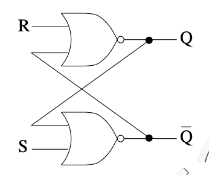
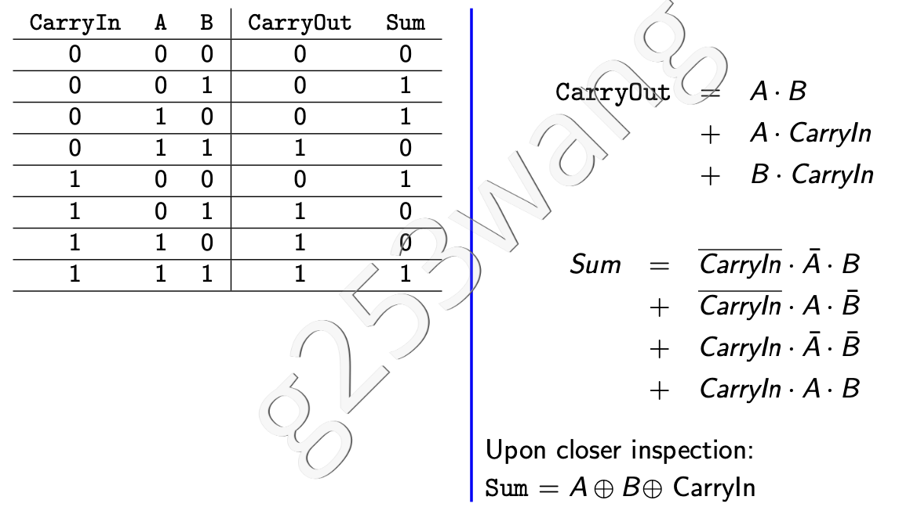
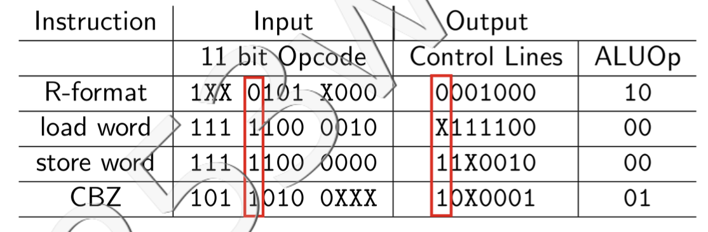

251:
- ARM64
- instruction: 32 bits, instruction size has no direct relationship with 32/64 bits system
- PC increment: 4 bytes
- word: 4 bytes ...... 64 bit machine should have word of 8 bytes, but 251 think otherwise...
- register size: 64 bits
- memory address: 64 bits, each memory address refer to a byte block, hence byte addressing
- memory capacity: 2^64 bytes
- every data in RAM is double-word, 8 bytes, 64 bits

# Lecture 1
Assembly language is a low-level programming language for a computer or other programmable device that is closest to the machine language. It is often specific to a particular computer architecture so there are multiple types of assembly languages. ARM is an increasingly popular assembly language.


ARM can be all of the below
- hardware archetecture
- assembly language
- program
- instruction set


In memory, from high memory address to low memory address, it goes
- stack (high mem addr)
- ...
- heap
- data (double words, 8 bytes, addr must be multiple of 8)
- code/program (this is where programs are stored, ARM/C++/Python, instruction size is 4 byte, so need to be multiple of 4)

## Register
In an ARM processor, there are 32 general purpose registers, used like a variable in an ARM instruction
- Each register has 64 bits, 8 bytes
- Registers are identified as X0, X1,...,X31
- X31 (XZR) is always 0

## ARM Program
one ARM program consists of multiple ARM instructions to execute

Each program insruction is one word in length
- Instruction address is multiple of four
- Special register, ***program counter*** (PC) stores address of the instruction that's currently being executed

# Lecture 2

## ARM Instruction
### R-Format
register
- `ADD X1,X2,X3`: X1 = X2 + X3, add content in X2 with content in X3, store result in X1
- `SUB X1,X2,X3`: X1 = X2 - X3

### D-Format
load/store "data" from/to RAM, which is multiple of 8, since data are stored as double-word, const can be pos and neg
- `LDUR X1,[X2,#24]`: Load data from memory address X2+24 into register X1
    - X2: base register
    - constant: -256 to 255
    - sum is a byte address, need to be multiple of 8
- `STUR X1,[X2,#32]`: Store data from X1 into memory at address X2+32

Convert `B[5] = B[4]` to ARM, assuming b[0] addr is stored at X1
``` arm
LDUR X2,[X1,#32]    // 4x8=32, assume each element in array is stored using 8 bytes
                    // Always take upper bound with multiple of 8 for element size
                    // ie: if each element is 10 bytes, it's stored in RAM with 16 bytes block, with 0 padding (left? right? idk)
STUR X2,[X1,#40]
```

### I-Format
constants are refered to as "immediate", can only be ***non-negative***, use `SUBI` if want to add a neg number, or do subtraction
- `ADDI X1, X2, #100`: X1 = X2 + 100
- `SUBI X1, X2, #100`: X1 = X2 - 100

Convert `a = a + 7` to assembly, assume a is in X1
``` arm
ADDI X1,X1,#7
```

### B-Format
branch, const can be pos and neg
- `B #28`: PC = PC + 4 x 28, jump to the next 28th instruction
    - constant is a word offset, since each instruction is 32 bytes, can be pos and neg
- `B #-1`: PC = PC + 4 x -1

### CB-Format
conditional branch, const can be pos and neg
- `CBZ X1,#8`
``` c
if X1 == 0
    PC = PC + 4 * 8
else
    PC = PC + 4  // go to next instruction, which is 4 bytes away
```
- `CBNZ X1,#8`
``` c
if X1 != 0
    PC = PC + 4 * 8
else
    PC = PC + 4
```

convert following to ARM, use register X1 for variable i
``` c
i = 10;
while (i > 0)
    i = i - 1;
i = -5;
```
``` arm
ADDI X1,XZR,#10
CBZ X1,#3       // direct translation, not "fully direct" since branch should be for all X1 <= 0 
SUBI X1,X1,#1
CBNZ X1, #-1
SUBI X1,XZR,#5
```


# Lecture 3
- Clock cycles: discrete intervals when hardware events (fetch, decode, execute, etc.) take place
- Clock period: length of a clock cycle (ie: 0.1 s/cc)
- Clock rate: 1 / clock period (ie: 10 cc/s)

To improve performance:
- reduce the length of the clock cycle (clock period, time per cc)
- reduce the number of clock cycles for a program

## Cycles Per Instructions (CPI)
CPI: the average number of clock cycles each instruction takes to execute.

number of clock cycles = number of instructions × CPI


# Lecture 4
Combinational circuits don't have memory, they take input and produce output

Sequential circuits has memory, they will store some outputs and feed them back as inputs

Every truth table must have
- exactly one output for each input.
- each possible input must be specified exactly once.

## Boolean Function
- sum of product, used when have less 1 in truth table
- product of sum, less 0 in table (not in scope of cs251)
    - negate the table, get a sum of product, then negate the boolean function

similar to DNF (disjunctive normal form, sum of product) and CNF (conjunctive normal form, product of sum) in CS245

## Don't Cares (X)
When ***X*** is used as input, it means that the value of the input doesn't affect the output, input could be 1 or 0 and output will be the same.

When ***X*** is used as output, it means that we simply don't care about the output, hence the input combination is impossible, or just ignored

## Gates and Formulas
- NOT
- AND
- OR
- NAND
- NOR
- XOR: A ⊕ B -> A or B but not A and B
    - In general, the output of XOR is 1 if the input has an odd number of 1’s.
        - 1 ⊕ 0 ⊕ 1 = (1 ⊕ 0) ⊕ 1 = 1 ⊕ 1 = 0
        - 1 ⊕ 1 ⊕ 1 = (1 ⊕ 1) ⊕ 1 = 0 ⊕ 1 = 1
- XNOR: not (A ⊕ B)
    - output 1 if input has even number (0 is even!!) of 1's 

use bubble to represent "NOT" for input and output when drawing circuits


# Lecture 5
## Decoder
- ***n inputs, 2<sup>n</sup> outputs***
- Example: 3-to-8 (or 3-bit) decoder
- SOP form for each output function is exactly **one** minterm
    - each output function can be represented as only ONE product of all the terms

## Multiplexor
- ***2<sup>n</sup> inputs*** (D<sub>0</sub>, ... , D<sub>2<sup>n</sup>−1</sub>), ***n select lines*** (S<sub>n-1</sub>, ... , S<sub>0</sub>), ***1 output*** (value same as the input D<sub>S</sub>, where S is the decimal value of the binary number represented by "S<sub>n-1</sub> ... S<sub>0</sub>")
- Example: 4-1 Multiplexer

### Arrays of Logic Elements
use slash to represent parallel constructions
 
Ex: 64-bit wide 2:1 multiplextor is equal to #64 2:1 multiplexors combined together. They all have the same select line, so these 64 MUX will all select A or all select B.

Just think of 64-bit wide 2:1 MUX as selecting a result of 64 bit


## Programmable Logic Array (PLA)
input -> AND -> OR -> output (could have multiple output functions)

Can be used to implement any boolean function as sum of products

# Lecture 6
***electricity flow from drain (power, VDD) to source (ground, GND, VSS) !!!!!!!!!!!***
## nMOS Transistor
An electrically-controlled switch
- A = 0, high resistance, so electricity cannot flow through the switch
- A = 1, low resistance, electricity can flow throgh
- pass strong 0, weak 1

## pMOS Transistor
Opposite behaviour compared to nMOS
- A = 0, low resistance
- A = 1, high resistance
- pass strong 1, weak 0

“bubble” on input A indicates transistor works in opposite manner to nMOS

## CMOS circuit
CMOS circuit uses both nMOS and pMOS transistors.

We wan to build circuits where there is a low resistance path to only one of power or ground. If the circuit is connected to both power and ground, it will cause short circuit, and we don't want that.

For strong transmissions, ALWAYS connect pMOS to power (strong 1), nMOS to ground (strong 0)

### Analyze CMOS circuit:
- truth table with inputs, transistors, output
- evaluate resistance of transistors, H or L, for every input combination
- output is
    - 1 if there is a low resistance path to power
    - 0 if there is a low resistance path to ground
    - Z (floating state) if there are no low resistance path to either power or ground

#### Number of Transistors per Gate
- NOT: 2 transistors
- NAND: 4 transistors
- NOR: 4 transistors
- AND: 6 transistors
- OR: 6 transistors

key take away
- **2-n input NAND** uses **2n** transistors
- **2-n input AND** uses **2n + 2** transistors (equivalent to 2-n input NAND with NOT in the end)
- 2-n input NOR has same number of transistors as 2-n input NAND
- 2-n input OR has same number of transistors as 2-n input AND

Thus we ***prefer to implement circuit with NAND, since it requires less transistors***

## Tri-state Buffer Gate
Has three outputs, 0, 1, floating (connected to neither power or ground)

- C = 1, not C = 0
    - both resistors are low resistance
    - nMOS transmit strong 0 if X = 0
    - pMOS transmit strong 1 if X = 1
- C = 0, not C = 1
    - both transistors have high resistance, so output is connected to neither power or ground, thus output is floating

Usefull cuz we can control when to sync F with X. Sync only happen with C = 1


# Lecture 7
## Sequential Circuit
A sequential circuit has a storage (state) element

Synchronous sequential circuit: it has a clock and storage (memory) **changes only at discrete points in time** (clock pulse, similar to PWM cycle). 

Asynchronous: no clock, potential faster and require less power, but harder to design and alalyze. Not in scope of 251

### SR Latch
- can remember values of Q (SR=00), reset Q = 0 (SR=01), set Q = 1 (SR=10)
- BUT undefined with SR=11, and don't have clock



### D Latch
Improved on SR Latch. Now have clock (C) and data (D) that we want to save, it also avoid the SR=11 undefined case

Q is D when C is high (1) and preserve value when C is low (0)

Problem when D changes while C is high, Q will change with D, but we want D to only change at rising/falling-edges of C


### D Flip-Flop
D flip-flop **only** passes the value of D to Q<sub>E</sub> on the **falling-edge** (goes from high to low) of C (clock)

When inverted clock is input to the D flip-flop, it only passes the value of D to Q<sub>E</sub> on the **rising-edge** (from low to high) of C (clock)

Both are called **edge-triggered**, doesn't matter which one to use, both work the same


# Lecture 8
## Finite State Machine
- input + current state -> next state function -> next state
- state -> output function -> output

From finite state machine, we can get a ***next state table***, that takes in input + current state, and generate next state. We can get a next state function from this table

From all the states, we can generate an ***output table***, from which we can get a output function.

We could also trace through the FSM when given the starting state and input at each cycle

---

### Ex


# Lecture 9
## Data Representation
decimal <--> binary <--> hex

- unsigned
- sign and magnitude, have duplicate 0
- two's complement: **flip bits, add 1**

### Carry Out
We ignore any carry out, and result will still be correct


### Overflow
consider a + b = c
- a, b same sign, c different sign ----> **overflow happened**
- a, b different sign ----> impossible to overflow

## Full Adder
- 3 bits as input: A, B, CarryIn
- 2 bits as output: Sum, CarryOut

make a truth table, get SOP for Sum & CarryOut

A - B = A + (-B) = A + (not B + 1) by two's complement \
so in addition (A + B), first CarryIn = 0 \
but in subtraction (A - B), first CarryIn = 1. We also need to input (not B) instead of B



## Logical Operator
- bitwise and
- bitwise or
- bitwise xor

bitwise not is just bitwise xor with all 1s

## ALU
extends functionality of full adder. ALU can now perform AND, OR, addition


# Lecture 10
## Unsigned Binary Multiplication
In 251, all binary multiplications are **unsigned**

Note: for n bit numbers, result may be 2n bits


## Represent Real Numbers
work just like decimal
- 1.01<sub>2</sub> x 2<sup>4</sup> = 10100<sub>2</sub> = 20<sub>10</sub>
- 1.01<sub>2</sub> = 1 x 2<sup>0</sup> + 0 x 2<sup>-1</sup> + 1 x 2<sup>-2</sup> = 1 + 1/4 = 5/4 <sub>10</sub>

In scientific notation
- -1.010 x 2<sup>3</sup> <sub>2</sub> (this is in binary)
    - "-": sign
    - 010: fraction (dot is not included)
    - 3: exponent
    - 1.010: significand

This is represented as
- bit 31 (S): sign for entire fraction, 1 for neg, 0 for pos
- bit 30 - 23 (E, exponent represented in unsigned binary): add 127 to exponent (biased notation, with bias = 127), then convert the result to an unsigned binary number. Pad 0 from left.
- bit 22 - 0 (F): fraction part. Pad 0 from right

Don't need to record the "1" before the "dot ." Since scientific numbers are always normalized, hence in the form (+/- 1.F x 2<sup>E</sup>)

floating point value in decimal = (−1)<sup>S</sup> × (1 + fraction) × 2
<sup>(exponent−bias)</sup>

### Valid Bias Range
after convertion, we have 8 bit unsigned number, in range [0, 255], but 0 & 255 are reserved, so valid range is [1, 254], hence [(1-127), (254-127)] == [-126, 127] is the valid range for exponents before converting to bias notation

if exp after convert to bias is outside the range [1, 254], then overflow/underflow happened

### Decimal to Binary
- 0.625<sub>10</sub> to 0.101<sub>2</sub>
    - multiply decimal by 2 to get d
    - take decimal before decimal point "." as binary digit
    - repeat until value on right side of decimal point "." is 0, that is d = 1.0
- 2.625<sub>10</sub> to binary
    - 2.625<sub>10</sub> = (2 + 0.625)<sub>10</sub> = (10 + 0.101)<sub>2</sub> = 1.0101<sub>2</sub> x 2<sup>-1</sup>


# Lecture 11
### Accuracy
don't need to care about rounding or truncating in 251. Just keep all digits

## Floating-Point Addition
- convert decimal to binary
- sync exponent to the larger degree
    - if have 2<sup>-2</sup>, 2<sup>-1</sup>, sync both to 2<sup>-1</sup>
    - ~~truncate if needed, NO rounding~~
- addition
- change exponent back to scientific notation
    - ~~ROUND + truncate~~
- make sure exponent is within valid bias range

## Floating-Point Multiplication
- add exponents
- multiply significand (1.xxx)
- shift decimal point "." by total number of decimal digits between the two inputs
- add sign based on the two inputs
- ~~ROUND + truncate~~

# Lecture 12
## ROM
n input, m output

ROM is like a lookup table, with 2^n rows of m-bit data

Ex: when input is 00, wordline<sub>0</sub> becomes 1 and the two nMOS transistors now have Low resistance, so bitline<sub>2</sub> and bitline<sub>1</sub> are pulled to ground, thus D<sub>2</sub> = D<sub>1</sub> = 0 and D<sub>0</sub> = 1 remains unaffected. Other wordlines are decoded to 0, so all other nMOS transistors have High resistance, and won't affect behaviour of the bitline


## Register and Register Files
Register: an array of D-flip-flop. We need 64 D-flip-flop to implement a 64 bit register. We use shared clock between all D-flip-flop so all bits of the register are updated at the same time. 

Note: PC is also a register, implemented using 64 D-flop-flops

Register file: a way of organizing registers

### Read/Write Logic for Register File
READ: MUX of 5-bit select line (Read Register Numer), each Register_i is 64-bit wide, so output (Read Data i) is 64-bit

WRITE: Register Data is 64-bit, Write is 1-bit, Register Numer is 5-bit, and is decoded into 32 output of 1-bit output


## RAM - Random Access Memory
### SRAM - Static RAM
Static because remember data until powered off

Can implement SRAM using only 6 transistors, much less than D-flip-flop and D-latch

Where SRAM is used?
- Build registers in modern processors (D-flip-flop and D-latch are actually not used in modern processors)

**why SRAM?**
- **fastest** compare to DRAM, D-flip-flop and D-latch
- uses less transistors compare to D-flip-flop and D-latch


### DRAM - Dynamic RAM
Dynamic because need to recharge to remember, otherwise capacitor will lose its charge, and the stored data will be forgot

DRAM is made from 1 capacitors and 1 transistors, so cheaper than SRAM, and smaller physical space

- DRAM is cheaper than SRAM, but slower
- capacitor will lose its charge, require recharge unit, that's why it's slower.
- ~~Refresh controller must also allow read/write access~~
- ~~Possibility of getting more bits out at a time (e.g. page-mode RAM)~~

**why DRAM?**
- **cheaper** than SRAM, smaller physical size


# Lecture 13
## Fetch-Execute Cycle
- Fetch
- Decode
- Execute


## Frist Implementation (One Cycle Per Instruction)
- clock must be slowed to speed of slowest instruction

### Fetch
PC is implemented using D-flip-flop, so writting to PC during the clock cycle will not change the output Q<sub>E</sub> until next clock cycle


### Datapath (ADD/SUB)
- RegWrite = 1
- ALU operation = 0010 for ADD
- ALU operation = 0110 for SUB


### Datapath (LDUR/STUR )
- ALU operation = 0010 (a + b)
- LDUR: MemWrite = 0, MemRead = 1, RegWrite = 1
- STUR: MemWrite = 1, MemRead = 0, RegWrite = 0


### Datapath (Combine R-format & D-format)
- MUX with ALUSrc selects Reg File output OR Sign-extended constant
- MUX with MemtoReg selects ALU output OR Memory Read output


### Datapath (CBZ)
- RegWrite = 0
- ALU operation = 0011 (pass b)


### Datapath (Combine R-format & D-format & CB-format)
- MUX with PCSrc selects between PC+4 OR CBZ address


### Datapath with Control
The circuit below only work with ADD/SUB/LDUR/STUR/CBZ

To support CBNZ, changes need to be made to control unit and how PCSrc is generated

#### Opcode
Opcode length based on format
- R-format: 11 bits
- I-format: 10 bits
- D-format: 11 bits
- B-format: 6 bits
- CB-format: 8 bits


# Lecture 14


## ALU Control
- Operation3 = 0
- Operation2 = ALUOp1 · Opcode30
- Operation1 = (not ALUOp1) + ALUOp1 · Opcode24
- Operation0 = ALUOp0 + ALUOp1 · Opcode29


## Control Unit


### Opcode
Opcode could be simplified, and we are only interested in bits 30, 28, 27, 26, 25, 22


### Simplified Circuit
- Input
    - Opcode bits at index 30, 28, 27, 26, 25, 22
- Output
    - Reg2Loc, ALUSrc, MemtoReg, RegWrite, MemRead, MemWrite, Branch
    - ALUOp1, ALUOp0


## Operation Time for Datapath Component
Add up all the time each component take (instruction memory, register file, ALU, data memory)

If the instruction does not need the second input in ALU to come from register file, then time cost for control unit does not affect operation time. Otherwise, register file has to wait untill control unit is finished, before continues. Adders will happen in parallel, and won't affect operation time. 

# Lecture 15
## Pipelining
Parallel execution of multiple instructions. Want to have steady throughput, so one new instruction launched per cycle


Divide datapath into 5 stages
- Instruction Fetch (IF): fetch instruction from memory
- Instruction Decode (ID): decode instruction & read from registers
- Execute (EX): ALU operations
- Memory (MEM): access (read/write) data memory
- Write Back (WB): write result back to register

Note: each datapath will go through all stages, even if some stages don't have any impact (MEM in ADD)

Write to registers happen in first half of clock cycle, read happen in the second half. So we can now read the new (just updated) register data. And not have read/write collision (try to read & write into same register the same time)

### Notation


- shading means a stage uses the hardware (ie: ADD doesn't access MEM)
- dashed line: component only run in first (or second) half of the cycle (ID, WB)
- left shaded: writing (WB)
- right shaded: reading (IF, ID)

## Structual Hazard
Structural hazards usually require a major design change

Problem: can't read from two locations on the same memory chip the same time


Solution: two separate components, instruction memory + data memory

## Data Hazard
### Hazard 1
Problem: writing to X1 happens **after** read of SUB


Solution: ***forwarding*** – take value to be written to X1 before it is written to register file


Note: ADD actually spend 1cc in MEM but nothing meaningful happened because MemRead/MemWrite flags are turned off by Control unit

### Hazard 2
Problem: Load-Use Data Hazard, forwarding from EX stage is not helpful. Need to forward from MEM stage


Solution: SUB must stall for one stage. Use “bubbles” to show stalling.

Can use hardware to detect this stall, or use software to reorder instructions (do some meaningful instructions instead of just stalling for nothing)

## Control Hazard
Problem: pipeline **does not know** the address of the next instruction in the **next clock cycle**, whether it should be PC + 4 or PC + 4 × immediate


Solution: 
- Stall
    - Suppose the hardware can test the register, determine the branch target address and update the PC in the second stage ID (instruction decode)
- Predict
- Delay decision
    - rearrange instructions to **hide** branch delay, like Data Hazard 2


## Pipelined Version of Datapath
Pipeline registers (in blue) hold all necessary intermediate values


# Lecture 16
## Pipeline Registers + Control Signals


Note that Reg2Loc is replaced with Instruction[28] in ID stage

Control unit no longer generates Reg2Loc signal, instead, it's retrieved directly from Instruction[28]. This is done so that in ID stage, we don't need to wait till Control unit is finished before moving into register file (cuz we don't know what is register 2 yet, need to wait till Reg2Loc is generated)



## Data Dependency


Last four instructions use data written by first instruction. ADD and STUR are fine because they are retrieving X2 after X2 is updated in SUB. But ADD and ORR are still problematic as they are reading X2 before it is updated

### NOP
NOP is equivalent to `ADD X31, X31, X31`. And we could halt the datapath with NOP so AND would happen two cycles after SUB. This way, X2 will always be updated before it's retrieved

```
    ORIGINAL
SUB X2,X1,X3
AND X12,X2,X5
ORR X13,X6,X2
ADD X14,X2,X2
STUR X15,[X2,#200]

    NOP SOLUTION WITHOUT DATA HAZARDS
SUB X2,X1,X3
NOP                 // stall
NOP                 // stall
AND X12,X2,X5
ORR X13,X6,X2
ADD X14,X2,X2
STUR X15,[X2,#200]
```

## Forwarding
### Notation
- Rn1 is first input to ALU
- Rm2 is second input to ALU


```
1   SUB  X2, X1,X3 ; WB stage
2   AND  X12,X2,X5 ; MEM stage
3   ORR  X13,X12,X2 ; EX stage
```
- Between 1 and 3, there is MEM data hazard. Since result of SUB is now stored in MEM/WB pipeline register
- Between 2 and 3, there is EX data hazard. Since result of AND stored in EX/MEM pipeline register

### EX Data Hazard
1 means AND is right after SUB

EX Hazard **1a**, since X2 is Register**Rn1**
```
SUB X2, X1, X3
AND X12, X2, X5
```

EX Hazard **1b**, since X2 is Register**Rm2**
```
SUB X2, X1, X3
AND X12, X5, X2
```

### MEM Data Hazard
2 means there is an extra instruction between SUB and AND

MEM Hazard **2a**, since X2 is Register**Rn1**
```
SUB X2, X1, X3
AND X11, X12, X5
OR X13, X2, X1
```

MEM Hazard **2b**, since X2 is Register**Rm2**
```
SUB X2, X1, X3
AND X11, X12, X5
OR X13, X1, X2
```

### Most Recent Only!!!
Always foward from most recent **pipeline registers**


### Forwarding Unit Diagram


**Note:** MUX control is written in order "00, 10, 01" (0, 2, 1) instead of the regular order "00, 01, 10" (0, 1, 2)

# Lecture 17
## Load-Use Hazard
ONLY happen when `LDUR Rd ...` (ID/EX.MemRead, is 1 only for LDUR) is followed immediately by an instruction that uses this `Rd` as `Rn` or `Rm` (ID/EX.RegisterRd == IF/ID.RegisterRn1 or ID/EX.RegisterRd == IF/ID.RegisterRm2). Stall in this case

When hazard detection units detects a load-use hazard, the stall signal will be 1, so in the mux, all control signals will be selected to 0. Hazard detection unit will also freeze PC & IM/ID pipeline register by setting PCWrite and IF/IDWrite to 0


## Control Hazard
Move branch detection for CBZ to ID (decode stage), use a 64-bit OR gate to detect if register data is all 0. Sign extend, shift left by 2, add offset to PC are all moved to decode stage. This way, branch can be detected at an earlier stage. 

When branch is detected, `IF.Flush` is set to 1, so IF/ID consists of all 0s, and `=0` is set to 1, so PC will be updated to the new address


### Branch Data Hazard
**Stall 1 CC** then move from EX/MEM.RegisterRd to **second output from register file**


### Branch Load Hazard
Need to **stall for 2 CC**, then move from MEM/WB.RegisterRd to **second output from register file**

```
LDUR X1, [X1,#200]
CBZ X1,#100
```

## Assume Branch Not Taken
Always load PC+4, then if branch is needed, flush, update PC = PC+offset, then load again

## Assume Branch Not Taken
Always load PC+offset, then if branch is not needed, flush, update PC = PC+4, then load again

## Dynamic Branch Prediction
Start with an assumption on whether branch is taken. Everytime prediction is false, change Branch Taken (0 to 1, 1 to 0)


## Two-Bit Branch Prediction
Also need an initial start state, then follow the FSM (finite state machine). Note this FSM may be different in assignment/exam questions


## Execution Time
**Always have 4 CC for pipeline startup time**

```
ADDI X4, X31, #6    // Initialize counter to 6

                    // Instructions in the loop
LDUR X1, [X2,#20]   // 1. Branch to here
ADDI X1, X1, #4     // 2. Load-use stall
STUR X1, [X2,#20]   // 3.
ADDI X2, X2, #8     // 4.
SUBI X4, X4, #1     // 5. Decrement counter
CBNZ X4, #-5        // 6. Branch data stall, wait for X4

ADD X1,X2,X3
```

Assume branch not taken (so CBNZ always load PC+4, then flush, then load PC+offset)

Total Clock Cycle = 4cc (startup) + 1 (initialize counter) + 6 (loop) * [ 1 (load-use) + 1 (branch data stall) + 6 (instructions) + 1 (flush or execute instruction after last loop) ]

### Who Stalls?
- Load-use hazards: stall 1cc (LDUR followed by non-branch)
- Branch-load hazard: stall 2cc (LDUR followed by branch)
- Branch mispredicted: stall 1cc (flush & update PC)

## Average CPI

